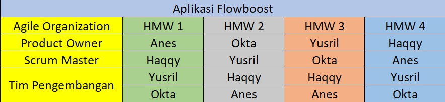

FlowBost 🚀
Aplikasi produktivitas all-in-one yang menggabungkan video motivasi, teknik Pomodoro, dan konten relaksasi untuk membantu Anda mencapai flow state optimal dalam bekerja dan belajar.
📖 Tentang FlowBost
FlowBost adalah aplikasi yang dirancang untuk meningkatkan produktivitas dan kesejahteraan mental Anda melalui empat pilar utama:
1. Nama Aplikasi : FlowBoost 

2. Deskripsi Aplikasi : FlowBoost is a comprehensive productivity application designed to help users manage their time, stay motivated, maintain mental wellness, and achieve their goals. 

3. Kelas-NIM-Nama :
 D-202210370311222-Auliana Yus Nesta Sari 
 D-202210370311233-Okta Ramji Saputra 
 D-202210370311234-Muhammad Yusril Islam 
 A-202210370311249-Muhammad Firdig Haqqy Abdillah
  
 
4. Link Figma : https://www.figma.com/design/DKMYWMdf6pzBcBUszDaVzl/Untitled?node-id=0-1&t=TZ8C3TSuf7GrI4sH-1
 
5. Worksheet : https://drive.google.com/drive/folders/1CjQ_yGrzEZUKE_I9CKafI1n-YnxhSQCO?usp=drive_link 

6. Low Fidelity Prototype : https://drive.google.com/drive/folders/1gr1-cTAlTySZjNi_fWwNuu5A2Pfmovf6?usp=sharing
 
7. Tabel pembagian BackLog : 
