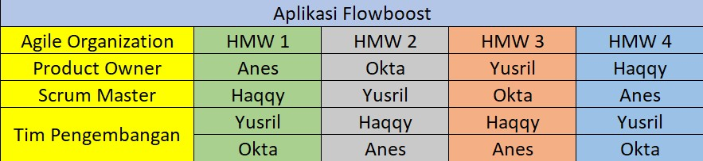

# FlowBoost 🚀

Aplikasi produktivitas all-in-one yang menggabungkan video motivasi, teknik Pomodoro, dan konten relaksasi untuk membantu Anda mencapai flow state optimal dalam bekerja dan belajar.

## 📖 Tentang FlowBoost

FlowBoost adalah aplikasi yang dirancang untuk meningkatkan produktivitas dan kesejahteraan mental Anda melalui empat pilar utama...

### 4.a. Nama Aplikasi
FlowBoost

### 4.b. Deskripsi Aplikasi
FlowBoost adalah aplikasi produktivitas komprehensif yang dirancang untuk membantu pengguna mengelola waktu mereka, tetap termotivasi, menjaga kesehatan mental, dan mencapai tujuan mereka.

### 4.c. Kelas-NIM-Nama-Username GitHub
1. D - 202210370311222 - Auliana Yus Nesta Sari - aulianayusnesta
2. D - 202210370311233 - Okta Ramji Saputra - okttaacx
3. D - 202210370311234 - Muhammad Yusril Islam - Atzee7
4. D - 202210370311249 - Muhammad Firdig Haqqy Abdillah - Firdig

### 4.d. Link Figma
https://www.figma.com/design/DKMYWMdf6pzBcBUszDaVzl/Untitled?node-id=0-1&t=TZ8C3TSuf7GrI4sH-1

### 4.e. WorkSheet
[worksheets](https://github.com/Firdig/Flowboost-mobileapp/tree/main/flowboost/worksheets)

### 4.f. Low Fidelity Prototype
[low-fidelity-mockup](https://github.com/Firdig/Flowboost-mobileapp/tree/main/flowboost/low-fidelity-mockup)

### 4.g. Tabel Pembagian Tugas (Backlog)

